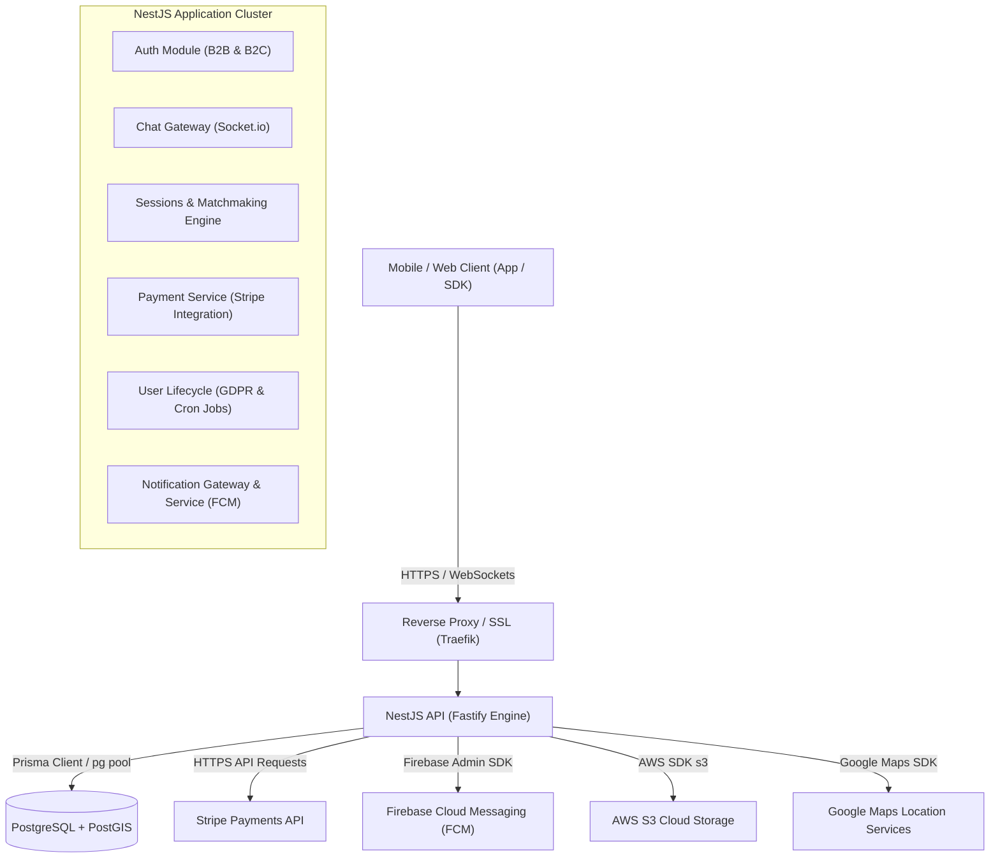

# Architecture Technique - Ludora Backend

Ce document détaille l'architecture logicielle, la structure de la base de données et les choix techniques du backend de l'application **Ludora**.

---

## 1. Vue d'ensemble

Le backend de Ludora sert d'API REST et de moteur temps réel (WebSockets) pour l'application mobile et web Ludora. Il orchestre les fonctionnalités suivantes :
*   Gestion et planification des sessions sportives.
*   Indexation et géolocalisation des infrastructures partenaires et des terrains publics.
*   Moteur de recommandation spatio-temporel et de matchmaking de sessions.
*   Messagerie instantanée et gestion des statuts de lecture.
*   Notifications push multiplateformes (iOS/Android/Web) via Firebase Cloud Messaging (FCM).
*   Monétisation et flux financiers sécurisés via Stripe (Stripe Connect / Webhooks).
*   Respect du RGPD (cycle de vie utilisateur, anonymisation et purge programmée).

### Diagramme d'Architecture Globale

---

## 2. Stack Technique de Référence

Le backend est conçu autour d'une stack technique orientée performance, modularité et scalabilité :

*   **Framework Principal :** [NestJS](https://nestjs.com/) (TypeScript). Choisi pour sa structure stricte en modules, contrôleurs et services, facilitant la maintenabilité et l'injection de dépendances.
*   **Moteur HTTP :** Fastify (`@nestjs/platform-fastify`). Utilisé à la place d'Express pour ses performances de routage supérieures et sa faible empreinte mémoire.
*   **ORM / Accès Base de Données :** [Prisma](https://www.prisma.io/) (v7+). Il s'interface avec PostgreSQL en utilisant l'adaptateur de connexion `@prisma/adapter-pg` via un pool `pg` natif pour optimiser les performances en environnement asynchrone. Le schéma Prisma est modulaire grâce à la fonctionnalité de division de schéma (`prisma/schema/*.prisma`).
*   **Base de Données :** **PostgreSQL** combiné à l'extension spatiale **PostGIS** pour stocker et calculer efficacement les données géographiques (latitude/longitude des terrains et des utilisateurs).
*   **Temps Réel (WebSockets) :** [Socket.io](https://socket.io/) (`@nestjs/platform-socket.io`) pour les conversations instantanées et les notifications interactives.
*   **Gestion des Secrets :** **HashiCorp Vault** (via l'outil `envconsul` et un script d'authentification AppRole `vault-auth.sh`) pour centraliser, sécuriser et injecter dynamiquement la configuration d'environnement en local (via Docker) et sur l'infrastructure d'hébergement.
*   **Supervision / Métriques :** Prometheus & Grafana (via `@willsoto/nestjs-prometheus` et `prom-client`) pour collecter et visualiser les métriques de performance système (temps de réponse, taux d'erreur, volume de requêtes).

---

## 3. Structure des Dossiers & Modularité

Le code source réside dans le répertoire `src/`. Il adopte une approche modulaire où chaque domaine métier (User, Session, Chat, Auth...) est encapsulé dans son propre NestJS Module.

### Structure standard d'un module métier
Chaque module (par exemple `src/users/`) respecte la structure suivante :
*   `*.module.ts` : Point d'entrée du module configurant les injectables et les imports/exports.
*   `controllers/` : Contrôleurs exposant les points de terminaison REST (Fastify).
*   `services/` ou `*.service.ts` : Contient les règles métiers fondamentales et les interactions avec la base de données.
*   `dto/` : Objets de Transfert de Données (DTO) pour valider (`class-validator`) et typer les requêtes/réponses. Il est structuré en deux sous-dossiers :
    *   `input/` : Pour les objets de requête (corps de requêtes, paramètres de requêtes) entrants.
    *   `output/` : Pour les objets de réponse retournés par l'API.
*   `mappers/` : Transformateurs de données entre modèles de base de données (Prisma) et DTOs de sortie (`output/`).
*   `constants/` : Constantes et configurations spécifiques au module.
*   `guards/` : Filtres d'autorisation de sécurité.

---

## 4. Conception des Principaux Modules & Décisions Techniques

### A. Authentification (B2B & B2C)
L'authentification est divisée en deux flux distincts au sein du `AuthModule` :
1.  **B2C (Business-to-Consumer) :** Destiné aux joueurs réguliers (`Users`). Gère l'inscription par e-mail/mot de passe (hachés via `Argon2`), Apple Sign-In (`apple-signin-auth`) et Google OAuth.
2.  **B2B (Business-to-Business) :** Destiné aux partenaires et organisations gérant des infrastructures sportives (`Partners`).

**Sécurité Globale :**
*   Le garde `AuthB2CGuard` est enregistré globalement (`APP_GUARD`), protégeant toutes les routes par défaut. Les endpoints publics (connexion, inscription, etc.) sont explicitement annotés avec le décorateur personnalisé `@Public()`.
*   Les tokens d'accès JWT (`JwtModule`) sont vérifiés en base de données à chaque requête via la table `UserTokens` pour permettre la révocation instantanée (ex. déconnexion globale ou suspicion de fraude).

### B. Moteur de Matchmaking et de Suggestions (`SessionsModule`)
L'application propose des sessions sportives de manière intelligente grâce à un algorithme de scoring hybride.
*   **Filtrage strict :** Élimine les sessions hors distance maximale (calculée avec PostGIS via `ST_DistanceSphere` sur la terre entière) ou incompatibles dans le temps.
*   **Scoring dynamique :** Attribue des points aux sessions selon les affinités de l'utilisateur (sports préférés, heures de disponibilité récurrentes ou ponctuelles, proximité exacte, niveau du joueur).
*   **Optimisation SQL :** Pour garantir des performances optimales, l'algorithme combine le calcul des scores en SQL natif via `Prisma.$queryRaw` et l'hydratation ultérieure des relations complexes en Prisma.
*   *Pour plus de détails techniques, consultez la documentation dédiée : [docs/SCORING_ALGORITHM.md](file:///Users/ganaf4ll/Documents/code/MDS/LUDORA/ludora-backend/docs/SCORING_ALGORITHM.md).*

### C. Chat Temps Réel (`ChatModule` & `ConversationsModule`)
Le système de chat est conçu pour être performant et horizontalement scalable :
*   **Sockets.io sans état (Stateless) :** Le backend n'utilise pas de structures mémoire globales (comme des `Map`) pour suivre les connexions. Les utilisateurs sont automatiquement joints à des "rooms" virtuelles (par utilisateur et par conversation). Cela permet d'ajouter un adaptateur Redis très facilement si le backend est répliqué sur plusieurs conteneurs.
*   **Découplage Événementiel :** Lorsqu'un message est supprimé ou lu via une requête HTTP classique, le backend émet un événement interne avec NestJS `EventEmitter2` (`EventTypes.MARK_MESSAGES_AS_READ`). Le `ChatGateway` intercepte cet événement et notifie instantanément les autres membres de la conversation connectés au WebSocket.

### D. Billing et Stripe Integration (`PaymentModule` & `WebhooksModule`)
Ludora intègre Stripe pour la facturation des réservations de créneaux.
*   **Paiement Asynchrone :** Les paiements s'effectuent via Stripe PaymentIntents. La confirmation définitive des paiements et des réservations s'effectue de manière asynchrone via des Webhooks Stripe.
*   **Idempotence :** Toutes les signatures de webhook Stripe sont cryptographiquement vérifiées. De plus, chaque événement Stripe est enregistré dans la table `StripeEvents` avec un statut (`PENDING`, `PROCESSED`, `FAILED`). Si Stripe renvoie le même webhook, le système détecte l'ID unique de l'événement et évite tout double traitement.
*   **Politique de Remboursement Seuil :** Les partenaires peuvent configurer des règles de remboursement automatique basées sur le temps (remboursement total, remboursement partiel sans commission plateforme, ou aucun remboursement).

### E. Cycle de Vie Utilisateur et RGPD (`UserLifecycleModule`)
La conformité RGPD est intégrée au niveau de l'architecture :
*   **Anonymisation (Soft Delete) :** Lorsqu'un utilisateur supprime son compte, ses données personnelles sont immédiatement écrasées par des valeurs génériques ou aléatoires. Son image de profil est supprimée du stockage cloud (AWS S3), et ses relations sociales (amis, préférences) sont purgées dans une transaction de base de données.
*   **Purge Automatique (CRON) :** Deux tâches planifiées s'exécutent quotidiennement à minuit :
    1.  `anonymizeExpiredUsers()` : Anonymise les comptes dont la date de suppression est passée.
    2.  `purgeAnonymizedUsers()` : Supprime définitivement et physiquement les enregistrements anonymisés datant de plus de 2 ans.

---

## 5. Architecture de la Base de Données

Le projet utilise **PostgreSQL** avec l'activation de plusieurs schémas logiques. Le schéma Prisma est organisé sous forme modulaire dans `prisma/schema/` pour éviter un fichier unique illisible :

| Schéma Postgres | Fichier Prisma | Description |
| :--- | :--- | :--- |
| `auth` | [auth.prisma](file:///Users/ganaf4ll/Documents/code/MDS/LUDORA/ludora-backend/prisma/schema/auth.prisma) | Gère les utilisateurs (`Users`), tokens de session (`UserTokens`, `RefreshTokens`), et vérifications par e-mail. |
| `infrastructure`| [infrastructure.prisma](file:///Users/ganaf4ll/Documents/code/MDS/LUDORA/ludora-backend/prisma/schema/infrastructure.prisma)| Gère les partenaires (`Partners`), les terrains (`Fields`), les créneaux disponibles (`FieldSlots`) et les sports supportés (`Sports`). |
| `sessions` | [sessions.prisma](file:///Users/ganaf4ll/Documents/code/MDS/LUDORA/ludora-backend/prisma/schema/sessions.prisma) | Enregistre les sessions sportives (`Sessions`), les invitations de joueurs (`SessionInvitations`), les équipes (`SessionTeams`) et la composition des joueurs (`SessionPlayers`). |
| `social` | [social.prisma](file:///Users/ganaf4ll/Documents/code/MDS/LUDORA/ludora-backend/prisma/schema/social.prisma) | Contient les relations d'amitié (`Friends`), les conversations (`Conversations`), les messages (`Messages`) et les accusés de réception/lecture (`MessageReceipts`). |
| `user_preferences`| [user_preferences.prisma](file:///Users/ganaf4ll/Documents/code/MDS/LUDORA/ludora-backend/prisma/schema/user_preferences.prisma)| Préférences de sport (`UserSportPreferences`), de modes de jeu (`UserGameModePreferences`) et d'heures de disponibilité (`UserHourPreferences`). |
| `billing` | [billing.prisma](file:///Users/ganaf4ll/Documents/code/MDS/LUDORA/ludora-backend/prisma/schema/billing.prisma) | Historique de paiements (`Payments`), demandes de remboursement (`Refunds`), politiques tarifaires partenaires (`PartnerBillingConfig`), et événements idempotents Stripe (`StripeEvents`). |
| `notifications` | [notifications.prisma](file:///Users/ganaf4ll/Documents/code/MDS/LUDORA/ludora-backend/prisma/schema/notifications.prisma) | Journal des notifications (`Notifications`) et tokens d'enregistrement FCM par équipement (`Devices`). |
| `ratings` | [ratings.prisma](file:///Users/ganaf4ll/Documents/code/MDS/LUDORA/ludora-backend/prisma/schema/ratings.prisma) | Gère les évaluations qualitatives post-session entre joueurs (`UserRatings`) et leur score global par sport (`UserGlobalRatings`). |
| `moderation` | [moderation.prisma](file:///Users/ganaf4ll/Documents/code/MDS/LUDORA/ludora-backend/prisma/schema/moderation.prisma) | Enregistre les blocages (`UserBlocks`) et les signalements d'utilisateurs (`UserReports`). |
| `shared` | [shared.prisma](file:///Users/ganaf4ll/Documents/code/MDS/LUDORA/ludora-backend/prisma/schema/shared.prisma) | Enums et types partagés (ex: `InvitationStatus`). |

---

## 6. Déploiement et Environnements

Le projet fournit plusieurs configurations Docker Compose situées dans le dossier `docker/` pour répondre aux différents contextes d'exécution :
*   `compose.local.yml` : Configuration minimale pour lancer PostgreSQL avec PostGIS en local.
*   `compose.dev.yml` : Environnement de développement complet incluant l'API Nest, la base de données, ainsi que la stack de monitoring Prometheus et Grafana.
*   `compose.staging.yml` / `compose.prod.yml` : Configurations renforcées optimisées pour l'exécution en pré-production et en production.
