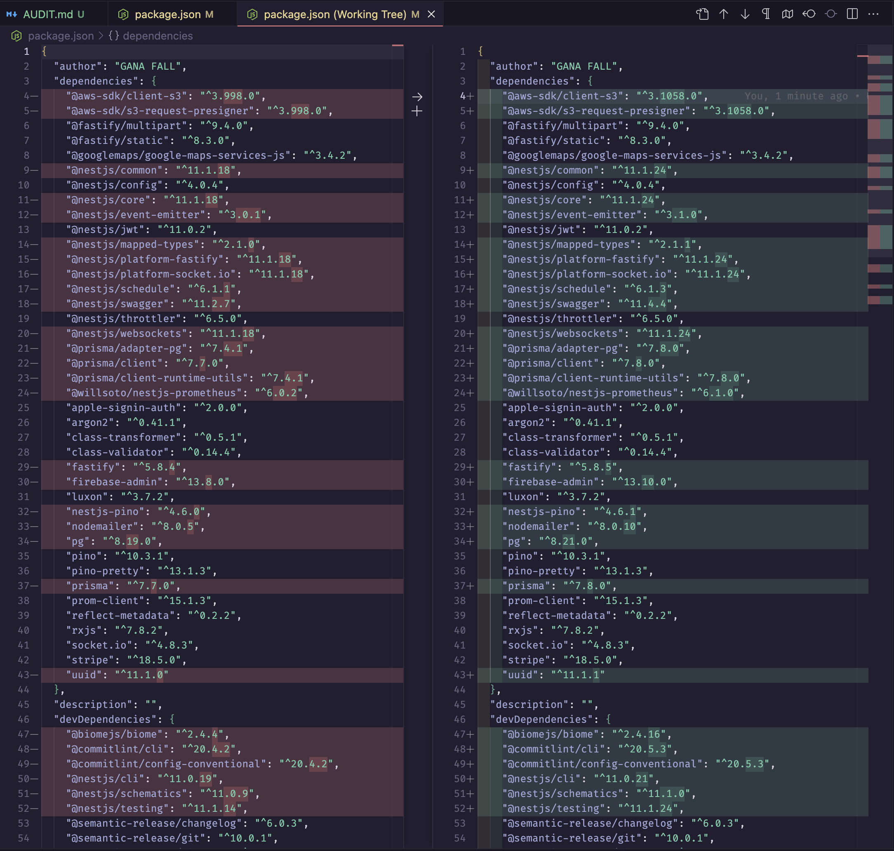

Après avoir lancer la commande

```typescript
pnpm outdated
```
et consulter le dependabot du repo j'ai obtenu ces résultats:


Plus de 100 packages sont obsolètes, avec des failles de sécurité critiques.
Dependabot nous donne des solutions pour mettre à jour ces packages, et nous indique les versions fixées.


Ainsi qu'une description apronfondie du problème:


Après avoir lancé

```typescript
pnpm upgrade
````
La majorité des packages ont été mis à jour, mais il reste encore quelques vulnérabilités, heureusement qu'il s'agit de failles de sécurité modérées. 



Et les tests passent toujours


