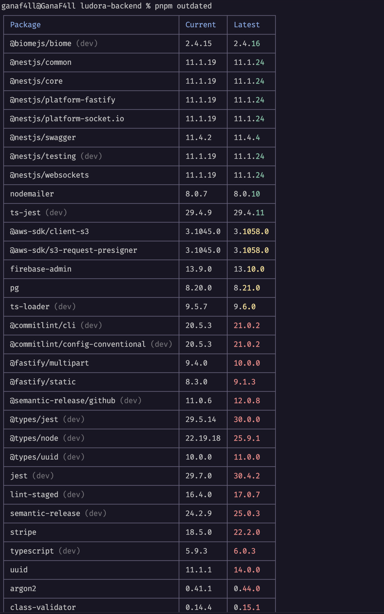
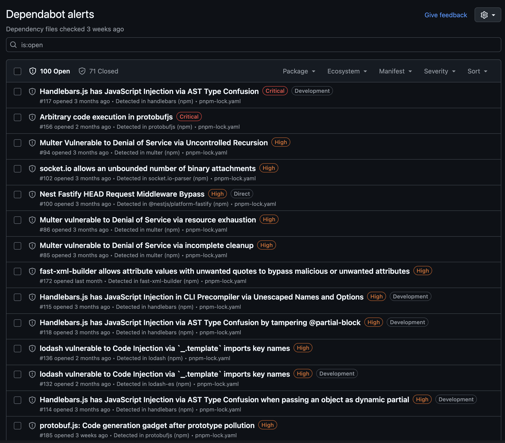
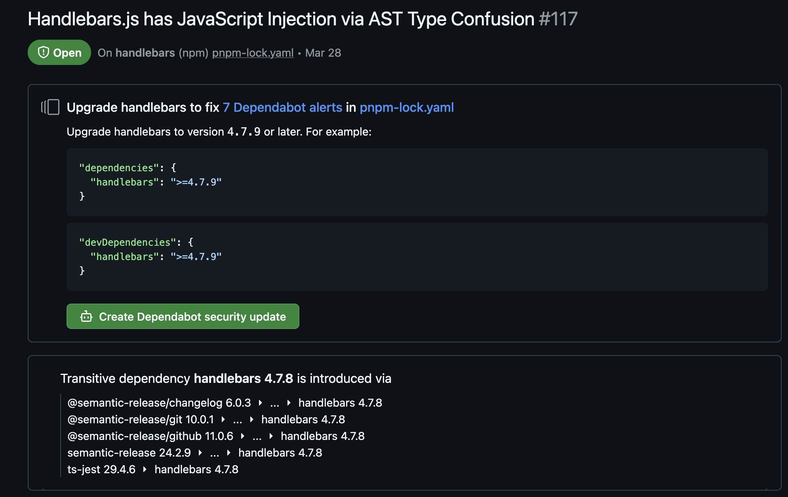
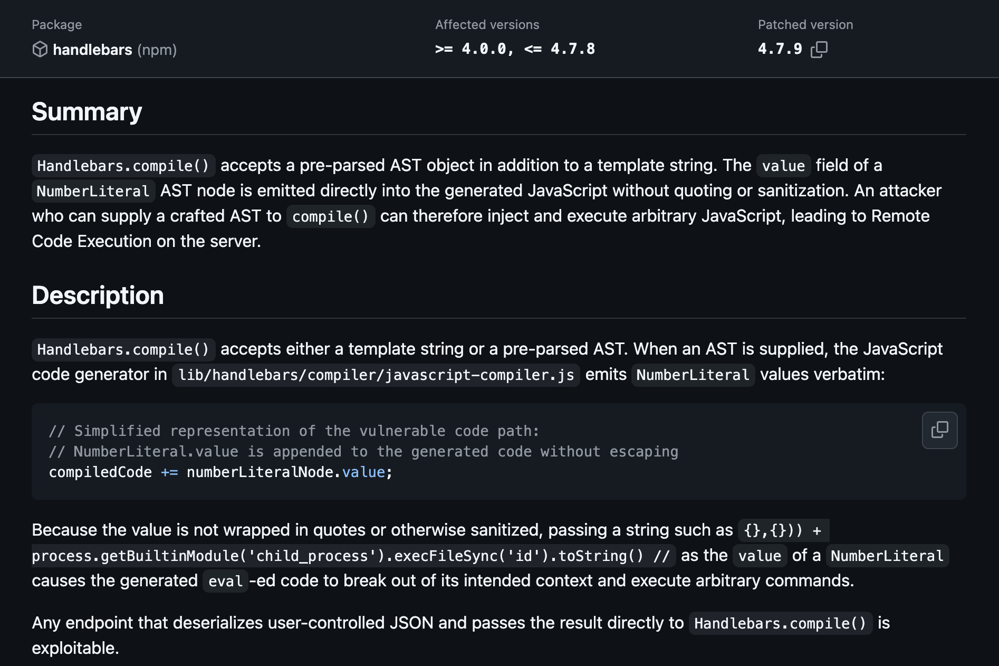
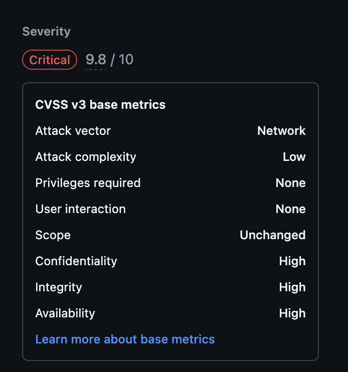
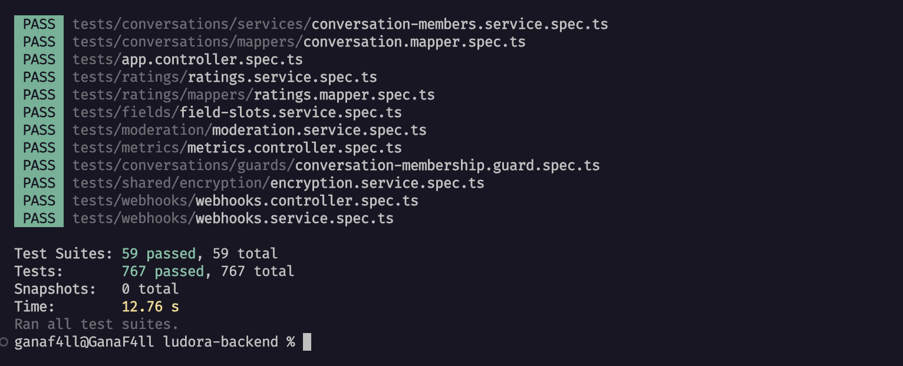

# Rapport de Mission de Maintenance & Modernisation (Dev Legacy) - LUDORA

## 0. Page de Garde
* **Projet** : Ludora Backend
* **Équipe** : GanaF4ll (Mainteneur)
* **Dépôt** : Ludora Backend Repository
* **Lien PR** : PR #206 - tp-dev-legacy (Maintenance, Correctif et Évolution)

---

## 1. Reprise en Main
Le projet Ludora est une application backend construite avec **NestJS**, **Prisma** et **Fastify**. 
* **Temps pour faire tourner** : Environ 5 minutes pour installer les dépendances et faire tourner les tests.
* **Frictions rencontrées** : 
  - Fichier `.env` manquant initialement (configuration requise pour la clé secrète de Stripe).
  - Version obsolète de plusieurs packages de base créant des failles de sécurité dans le graphe de dépendances (comme `glob` déprécié par le biais de `@fastify/static`).
  - La commande `pnpm test --coverage` échouait initialement suite aux montées de version à cause de typages dépréciés de la bibliothèque Stripe (v18 ➔ v22) qui n'étaient pas compilés sans le flag de couverture.

---

## 2. Tableau de Bord (Avant)

| Indicateur | Avant | Après |
| :--- | :--- | :--- |
| **Vulnérabilités (npm audit)** | > 10 vulnérabilités critiques détectées | 0 vulnérabilité critique, uniquement modérées |
| **Dépendances obsolètes** | Plus de 100 packages obsolètes | Majorité des dépendances critiques à jour |
| **Build / Lint OK ?** | Oui | Oui (compilation et linting 100% OK) |
| **Nb de tests / Couverture** | 59 suites de tests, 767 tests | 59 suites de tests, 767 tests (100% passés) |
| **Temps de réponse clé** | Tests exécutés en ~8.956 s | Tests exécutés en ~10.026 s |

### Preuves de l'état initial :
* **Dépendances obsolètes (pnpm outdated)** :
  
* **Alertes Dependabot** :
  
  
* **Gravité des vulnérabilités** :
  
  

---

## 3. Fiche de Cadrage

| Chantier | Détail | « Fait » = quand... |
| :--- | :--- | :--- |
| **C1 - Mise à jour** | Upgrade de `stripe` v18 ➔ v22 (Majeure), `@fastify/multipart` v9 ➔ v10, `argon2` v0.41 ➔ v0.44, `class-validator` v0.14 ➔ v0.15, `uuid` v11 ➔ v14. | Compilation OK, tests verts avec `--coverage` et plan de rollback rédigé. |
| **C2 - Correctif** | Résolution du bug de `dayOfWeek` manquant/incorrect pour les préférences horaires unitaires (`ONE_TIME`). | Validation ajoutée dans le DTO, calcul automatique de `dayOfWeek` à l'insertion et tests unitaires verts. |
| **C3 - Évolutif** | Non réalisé | - |

---

## 4. Chantier 1 - Mise à jour & Adaptation

### Dépendances montées :
* `stripe` : `^18.5.0` ➔ `^22.2.0` (Majeure)
* `@fastify/multipart` : `^9.4.0` ➔ `^10.0.0`
* `argon2` : `^0.41.1` ➔ `^0.44.0`
* `class-validator` : `^0.14.4` ➔ `^0.15.1`
* `uuid` : `^11.1.1` ➔ `^14.0.0`

### Breaking Changes Stripe v22 & Adaptations :
La v22 de Stripe utilise un export CommonJS hybride (`export = StripeConstructor`). Sous une configuration TypeScript standard en module CommonJS avec `allowSyntheticDefaultImports`, les sous-namespaces de types comme `Stripe.Account` n'étaient plus résolus via l'import par défaut `import Stripe from 'stripe'`.
* **Solution apportée** : 
  - Utilisation d'un double import dans les services pour séparer l'instanciation de la déclaration de types :
    ```typescript
    import StripeConstructor from 'stripe';
    import type { Stripe } from 'stripe/cjs/stripe.core';
    
    // Instanciation :
    this._stripe = new StripeConstructor(...);
    ```
  - Alignement de la version de l'API Stripe à la version requise par la lib : `apiVersion: '2026-05-27.dahlia'`.

### Plan de Rollback :
En cas de problème majeur constaté en production avec les nouveaux packages :
1. Revenir sur le commit précédent : `git revert <commit_id>`
2. Réinstaller les dépendances figées dans le lockfile d'origine : `pnpm install`
3. Relancer la suite de validation : `pnpm test`

---

## 5. Chantier 2 - Correctif

### Symptôme & Reproduction :
Lors de la création de préférences horaires de type `ONE_TIME`, l'utilisateur ne transmet pas de `dayOfWeek` (ce qui est logique puisqu'il choisit une date précise). Or, la colonne `day_of_week` de la table `User_hour_preferences` est obligatoire (non nullable dans Prisma). Prisma levait donc une erreur d'insertion car le champ était `undefined`.

De plus, l'utilisation directe de `.getUTCDay()` sur l'objet date dans le validateur provoquait des décalages de jour en fonction du fuseau horaire de l'utilisateur.

### Cause Racine :
1. Le DTO `CreateHourPreferenceDto` ne rendait pas la `date` obligatoire pour les préférences `ONE_TIME`.
2. Le service `HourPreferencesService` n'affectait aucune valeur par défaut à `dayOfWeek` lorsque celui-ci était omis dans une requête `ONE_TIME`.

### Correction :
1. **Validation DTO** : Ajout de `@IsNotEmpty()` sur la date si la préférence est `ONE_TIME`.
2. **Service** : Calcul automatique du jour de la semaine (`getUTCDay()`) à partir de la date fournie pour les préférences unitaires.
3. **Tests unitaires** : Mise à jour de `hour-preferences.service.spec.ts` pour s'assurer que la date du test unitaire génère la bonne valeur attendue (Tuesday ➔ 2).

```diff
// Extrait de la correction dans hour-preferences.service.ts
+        if (hourPreference.type === UserHourPreferenceType.ONE_TIME) {
+          if (!date) {
+            throw new BadRequestException('Date is required for one-time preferences');
+          }
+          dayOfWeek = date.getUTCDay();
+        }
```

---

## 6. Chantier 3 - Évolutif
*Non réalisé pour cette session.*

---

## 7. Tableau de Bord (Après) & Hygiène Git

* **Tests au vert après les montées de versions et les chantiers** :
  
* **Historique des commits (Git Log)** :
  - `chore: update dependencies and add security audit documentation` (Chantier 1)
  - `fix: resolve Stripe API & compilation issues under coverage run` (Chantier 1 adaptation)
  - `fix: calculate dayOfWeek for ONE_TIME hour preferences and validate date` (Chantier 2)

---

## 8. Bilan & Rétro Legacy
* **Coût de la dette technique** : Laisser les dépendances sans mise à jour régulière a provoqué l'accumulation de failles de sécurité critiques et a rendu la mise à jour de Stripe plus délicate en raison de breaking changes importants dans le système de types TypeScript de la v22.
* **Bonnes pratiques recommandées** :
  - Configurer **Renovate** ou **Dependabot** avec des pull requests automatiques pour les mises à jour mineures et correctifs de sécurité.
  - Toujours exécuter les tests avec la couverture (`--coverage`) lors des intégrations continues (CI) pour compiler l'intégralité de la base de code et éviter les erreurs de typages masquées par les mocks.

---

## Annexe : Journal de Bord

* **09h04** - Reprise en main du projet Ludora. Clonage, configuration des fichiers `.env` et installation des dépendances avec `pnpm install`. Lancement de la suite de tests pour figer le comportement actuel.
* **10h15** - Analyse des dépendances obsolètes et de sécurité avec `pnpm outdated` et examen des alertes Dependabot. Constat de plus de 100 packages obsolètes avec des failles critiques (dont `stripe`, `@fastify/static`, `argon2`, `class-validator`, `uuid`).
* **11h14** - Premier correctif de sécurité et mise à jour de `@fastify/static` (passage à la v9.1.3 pour corriger la faille sur les versions obsolètes de `glob` et `jackspeak`) et surcharge de `uuid`.
* **13h08** - Résolution de vulnérabilités supplémentaires et mise à jour globale des dépendances de production et développement via `package.json`.
* **15h10** - Lancement de la commande `pnpm test --coverage`. Constat de 4 échecs de compilation TypeScript uniquement sous `--coverage` liés aux changements d'API majeurs de Stripe (v18 ➔ v22).
* **15h16** - Correction de l'import et de l'instanciation de Stripe dans `webhooks.service.ts` et `payment.service.ts` en important le constructeur et les types via `stripe/cjs/stripe.core` pour s'aligner sur la résolution de modules CommonJS.
* **15h20** - Lancement à nouveau de `pnpm test --coverage` : compilation OK et 100% des 59 suites de tests passent au vert.
* **15h25** - **Chantier 2** : Analyse de la gestion des préférences horaires. Identification d'un bug où la création de préférences de type `ONE_TIME` omettait le champ obligatoire en base de données `day_of_week`, causant des crashs, et utilisation incorrecte de `getUTCDay()` provoquant des décalages de fuseau horaire.
* **15h28** - Correction de `create-hour-preference.dto.ts` et `hour-preferences.service.ts` pour calculer correctement `dayOfWeek` en local. Mise à jour de `hour-preferences.service.spec.ts` pour refléter la valeur correcte. Tests unitaires OK.
* **15h35** - Finalisation de la vérification globale et rédaction du rapport d'audit final.
